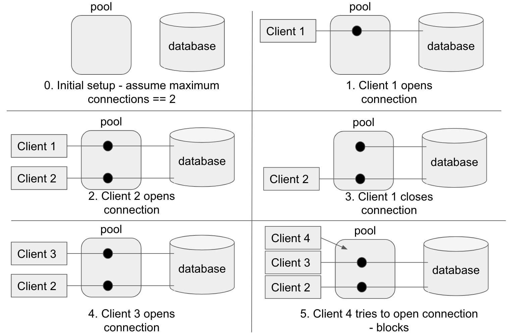

# COS316, Assignment 5: Connection Pool

## Due: [Date TBD] at [Time TBD]

## Background

Establishing connections to a database often involves several expensive steps,
such as creating a TCP channel with a database server, parsing a connection
configuration string, and authenticating a user.

In practice, most applications (clients) use only one or a few different database
connection configurations. This means that an application will repeatedly
open and close many identical database connections. 

Connection pooling is a way to avoid the overhead of reopening connections by
reusing existing ones. A connection pool manages a set of established
connections. When an application opens a connection to a database, the connection
pool finds an existing connection and returns the connection to the application.
When the application closes a connection, the connection pool adds the connection 
back to its list of available connections without actually closing the connection.

The diagram below illustrates a database connection pool at a high level:



## Objectives

The objective of this assignment is to implement a concurrent connection pool that manages a set of
connections to a sql database. It should support the following APIs:

```go

// Use this struct for storing pool related information
type Pool struct {
	...
}

// A database connection
type Conn interface {
	Query(string) (*sql.Rows, error)
}

// NewPool creates a new connection pool with connections to a database.
// It takes as input a function that actually establishes connections with
// the underlying database.
// Establishing a connection to a database might fail, in which case NewPool
// propagates the error from the underlying driver to its caller.
func NewPool(newConnection func() (Conn, error)) (*Pool, error)

// Open returns a connection from the connection pool. It should only return a
// connection when the number of open (i.e., in-use) connections is less than the 
// maximum pool size. Open should block (i.e., not return) when the number of 
// open (i.e., in-use) connections exceeds the pool's maximum.
// This function needs to be safe for concurrent use. When it is called by
// multiple goroutines, it should return unique connections to each caller.
func (p *Pool) Open() (*Conn)

// Close returns a connection back to the connection pool without actually closing
// it with the underlying database.
// When a connection is closed, using it has undefined behavior (i.e., applications
// should not do it).
// Close needs to return a connection to the pool it was originally allocated in.
// If the connection does not belong to the pool (i.e., c was not allocated to p
// originally), Close is a noop (i.e., no effects).
// Closing a connection that's not open is a noop.
func (p *Pool) Close(c *Conn)

// SetMaxConnections sets the maximum number of connections that a pool can
// maintain. If it sets to a number m that is smaller than the number of currently
// open connections, SetMaxConnections should block (i.e., not return) until the
// number of open connections drops below m.
func (p *Pool) SetMaxConnections(m int)

// GetMaxConnections returns the maximum number of connections that the pool can
// maintain.
func (p *Pool) GetMaxConnections() int

```
You might have noticed that this assignment is similar to Go's `database/sql`
package that you used in the last assignment. In particular, the
[`DB` type][sql_DB] implements a connection pool internally.

To actually establish connections with a database, the `sql` package relies on
database drivers. For example, `github.com/mattn/go-sqlite3` package that we
used in precepts and last assignment implements a driver for `sqlite3`. It is
the driver that handles communication with the underlying database.
For example, when calling `db.Conn()` in the `sql` package to get a new connection,
it internally calls another function in the `go-sqlite3` package which actually
establishes a connection with the database.

For this assignment, we are removing the complexity of a driver component from your
connection pool implementation. Instead, you can just use the `newConnection` function
(passed in as input to `NewPool()`) to acquire a new function with a underlying
database. You can think of `newConnection` as a driver's implementation of establishing
a new connection. The important note to keep in mind is that __you cannot assume this
`newConnection` function to be safe for concurrent use__.

__You should _not_ block by busy looping (e.g., `while condition {}`). Instead use something
like [condition variables][go_cond_var].__

### Concurrency

All the APIs should be safe for concurrent use. There will be multiple threads (goroutines)
that use the APIs concurrently. You need to make sure that your connection pool behaves
correctly. For example, calling `Open()` from multiple goroutines should return unique values
to each caller, assuming there are enough available connections in the pool. 

Moreover, if `SetMaxConnection()` sets the pool size to a number smaller than the number of
currently open connections, __`Open()` should also block (i.e., do not open new connections to
clients) until the number of open connections drops below the new maximum.__

### Lazy Allocation

Connection pool should allocate connections lazily (i.e. on demand). This means
your implementation should _not_ fill the entire pool with connections when it is first
created. Instead it should only open connections with the underlying database when a client
calls `Open()`. In fact, for this assignment, __increment the total number of connections in
your pool by only one when necessary.__

## Example Application

An example client is provided in 'client/main.go'. You can use that client to see how your
connection pool will be used and test your implementation.

The example application also implements a simple database driver. You can see an example of
a `newConnection` function passed into the `NewPool()` function. For actual grading, we are
using a more complex driver but the interface is exactly the same.

## Resources

[Go sync package][go_sync]: Go's mutex, condition variable, etc.

[Embedded mutexes][embedded_mutex]: You might want to check out using mutexes
as an [embedded field][go_embedded_field].

[sql_DB]: https://golang.org/pkg/database/sql/#DB "type sql.DB"
[embedded_mutex]: https://talks.golang.org/2012/10things.slide#3
[go_embedded_field]: https://golang.org/ref/spec#Struct_types
[go_cond_var]: https://golang.org/pkg/sync/#Cond
[go_sync]: https://golang.org/pkg/sync/

## Submission & Grading

Your assignment will be automatically submitted every time you push your changes
to your GitHub repo. Within a couple minutes of your submission, the
autograder will make a comment on your commit listing the output of our testing
suite when run against your code. **Note that you will be graded only on your
changes to the `conn_pool` package**, and not on your changes to any other files,
though you may modify any files you wish.

You may submit and receive feedback in this way as many times as you like,
whenever you like, but a substantial lateness penalty will be applied to
submissions past the deadline.
